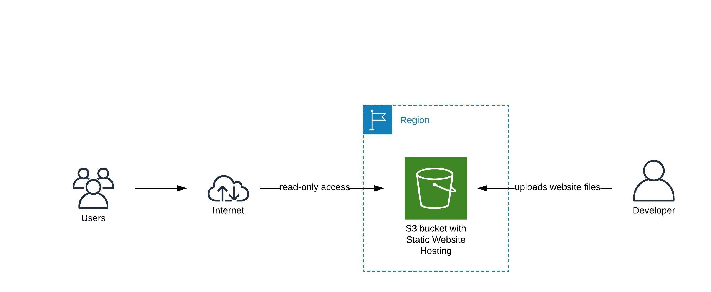

# Blog: Hosting a static website with different Cloud providers

## Overview

This is a project for the Project Gallery - a student-led initiative in the Udacity/Bertelsmann Technology Scholarship Challenge - Cloud Track.

## Websites with tutorials
AWS: http://static-website-with-cloud.s3-website-us-east-1.amazonaws.com/

Azure: coming soon

GCP: coming soon

## Project presentation
[Here](./project-presentation.pptx) you can find the project presentation containing information about the project and its deployment.

This is the architecture diagram for AWS: 
